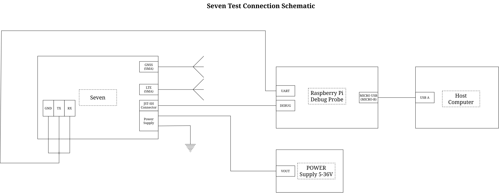

# Seven test

## Prerequisites

* [Raspberry Pi Debug Probe](https://www.electrokit.com/raspberry-pi-debug-probe.)

Install the required Ubuntu packages:

```bash
sudo apt update
sudo apt install curl python3 python3-venv
```

Install probe-rs:

```bash
curl --proto '=https' --tlsv1.2 -LsSf https://github.com/probe-rs/probe-rs/releases/latest/download/probe-rs-tools-installer.sh | sh
```

## Connect Seven

Before running the tests, connect Seven to the Raspberry Pi Debug Probe and external power supply
as shown below.



## Run tests

Run the complete Seven test:

```bash
VERSION=v0.0.1

mkdir -p ~/seven-test
cd ~/seven-test

curl -fL "https://raw.githubusercontent.com/id8-engineering/seven-test/$VERSION/scripts/test.sh" -o test.sh
curl -fL "https://raw.githubusercontent.com/id8-engineering/seven-test/$VERSION/requirements.txt" -o requirements.txt

chmod +x test.sh
./test.sh --version "$VERSION"
```

## Develop

See [DEVELOPMENT.md](DEVELOPMENT.md) to set up the development environment and build on Seven Test.
